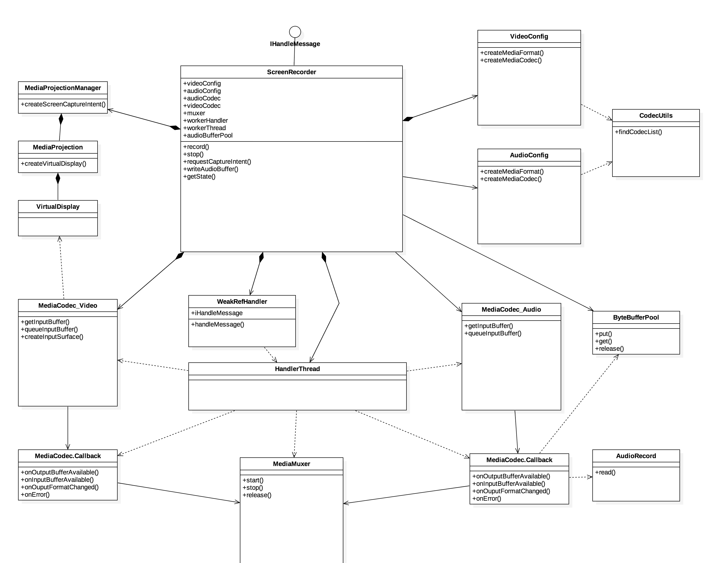

# ScreenRecorder
Easy to record android screen
written by kotlin

Download
--------
```groovy
implementation 'com.maxst:screenrecorder:1.0.0@aar'
```

if you can't find it then refer following below
```groovy
// project level build.gradle 
allprojects {
    repositories {
        ...
        maven {
            url  "http://dl.bintray.com/charlezz/maven/"
        }
    }
}
```

How to use
=======
once you call requestCaptureIntent() to be ready to record
```kotlin
ScreenRecorder.requestCaptureIntent(this, REQ_CODE)
```
start record from onActivityResult()
```kotlin
override fun onActivityResult(requestCode: Int, resultCode: Int, data: Intent?) {
	if (requestCode == REQ_CODE) {
			recorder = ScreenRecorder(this, it)
			recorder?.record()
	}
}
```
That's it!
pretty simple huh?

Screenshot
=======


License
=======

    Copyright 2018 Maxst, Inc.

    Licensed under the Apache License, Version 2.0 (the "License");
    you may not use this file except in compliance with the License.
    You may obtain a copy of the License at

       http://www.apache.org/licenses/LICENSE-2.0

    Unless required by applicable law or agreed to in writing, software
    distributed under the License is distributed on an "AS IS" BASIS,
    WITHOUT WARRANTIES OR CONDITIONS OF ANY KIND, either express or implied.
    See the License for the specific language governing permissions and
    limitations under the License.


